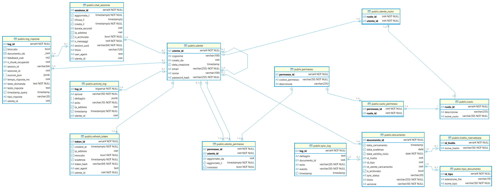

# 🏗️ Architettura e guida per sviluppatori

Questo documento descrive le decisioni architetturali, il flusso dei dati e come estendere il sistema.

---

## Indice

1. [Schema database](#1-schema-database)
2. [Pipeline di ingestion](#2-pipeline-di-ingestion)
3. [RAG Chain (LangGraph)](#3-rag-chain-langgraph)
4. [Sistema di autenticazione](#4-sistema-di-autenticazione)
5. [Dual-pipeline (Marker vs Mistral)](#5-dual-pipeline-marker-vs-mistral)
6. [Come aggiungere un nuovo endpoint](#6-come-aggiungere-un-nuovo-endpoint)
7. [Come cambiare modello LLM](#7-come-cambiare-modello-llm)
8. [Come cambiare modello di embedding](#8-come-cambiare-modello-di-embedding)

---

## 1. Schema database

### Diagramma ER — schema `public` (PostgreSQL)

Il diagramma seguente mostra tutte le tabelle del database, i tipi di colonna e le relazioni tra entità (generato da pgAdmin / DBeaver sull'istanza `policy_db`).



> **Come leggere il diagramma:** le linee con notazione crow's foot indicano le cardinalità (1:N, 0..1:N). Le colonne con 🔑 icona `serial4`/`bigserial` sono chiavi primarie surrogate (auto-increment); quelle con 🔗 `int4` che puntano a un'altra tabella sono chiavi esterne.

---

### Tabelle principali — descrizione

Le tabelle sono raggruppate per dominio funzionale.

#### Identità e accesso

| Tabella | Ruolo |
|---|---|
| `utente` | Anagrafica utenti: email, password_hash, nome, cognome, `creato_da` (self-FK → ownership) |
| `ruolo` | Catalogo ruoli (es. `SuperAdmin`, `Admin`, `User`) |
| `utente_ruolo` | Associazione N:M utente ↔ ruolo |
| `permesso` | Catalogo permessi atomici (`codice_permesso` UNIQUE) |
| `ruolo_permesso` | Associazione N:M ruolo ↔ permesso (permessi ereditati) |
| `utente_permesso` | Override individuali: `concesso=TRUE` (grant) o `FALSE` (deny), priorità assoluta sui permessi di ruolo |
| `refresh_token` | Token di refresh JWT: hash SHA-256, scadenza, flag `revocato`, IP e user-agent |

#### Documenti e knowledge base

| Tabella | Ruolo |
|---|---|
| `documento` | Registro documenti: titolo, versione, `sync_status`, date di validità, FK verso tipo e livello di riservatezza |
| `tipo_documento` | Lookup: categorie documentali (`nome_tipo`, `estensione_file`) |
| `livello_riservatezza` | Lookup: livelli di riservatezza (`nome_livello`) |
| `sync_log` | Log degli eventi di sincronizzazione PostgreSQL ↔ ChromaDB per ogni documento |

#### Chat e audit

| Tabella | Ruolo |
|---|---|
| `chat_sessione` | Sessione di conversazione: `session_uuid` (condiviso col frontend), `utente_id`, titolo, contatore messaggi, flag `is_archiviata` |
| `log_risposta` | Ogni Q&A: testo domanda/risposta, `tipo_risposta` (`content`/`courtesy`/`not_found`/`blocked`), `documento_ids` (array), `sources_json` (JSONB), latenza, rating CSAT |
| `activity_log` | Registro azioni di sistema (upload, ingestion, login, modifica utenti…): `azione`, `dettaglio` JSONB, `ip_address`, `esito` |

### Viste SQL utili

| Vista | Scopo |
|-------|-------|
| `v_permessi_effettivi` | Permessi reali per utente (override > ruolo) |
| `v_matrice_permessi` | Matrice utenti×permessi per pannello RBAC |
| `v_chat_audit` | Sessioni chat con statistiche per admin |
| `v_chat_messaggi` | Messaggi completi di una sessione |
| `v_activity_log_full` | Activity log con nome utente |
| `v_utenti_visibili` | Utenti visibili in base all'ownership dell'Admin |
| `v_dashboard_stats` | KPI per dashboard SuperAdmin |

### Funzioni SQL

| Funzione | Firma | Scopo |
|----------|-------|-------|
| `utente_ha_permesso` | `(utente_id INT, codice VARCHAR) → BOOL` | Controllo permesso singolo (override > ruolo) |
| `ruolo_di` | `(utente_id INT) → TEXT` | Ruoli CSV dell'utente |
| `purge_expired_refresh_tokens` | `() → INT` | Pulizia token scaduti |
| `purge_old_activity_logs` | `() → INT` | Pulizia log >90 giorni |
| `archivia_sessioni_vecchie` | `(giorni INT) → INT` | Soft-delete sessioni vecchie |

---

## 2. Pipeline di ingestion

### Flusso dati completo

```
                     ┌─────────────────────────────────────┐
                     │  POST /api/v1/admin/upload          │
                     │  → salva PDF in PDF_DIR/            │
                     └──────────────┬──────────────────────┘
                                    │
                     ┌──────────────▼──────────────────────┐
                     │  POST /api/v1/admin/ingest/{file}   │
                     │  → avvia job in background          │
                     │  → WebSocket /progress/{job_id}     │
                     └──────────────┬──────────────────────┘
                                    │
              ┌─────────────────────▼──────────────────────┐
              │         _run_ingestion_sync()               │
              │                                             │
              │  Pipeline MARKER:        Pipeline MISTRAL:  │
              │  marker_service          mistral_ocr_service│
              │  → converti_pdf()        → processa_pdf_    │
              │  postprocessor_service     con_mistral()    │
              │  → processa_markdown()                      │
              │  chunker_service                            │
              │  → chunking_e_indicizzazione()              │
              │                                             │
              │  Output: {stem}_chunks.json in OUTPUT_DIR  │
              └─────────────────────┬───────────────────────┘
                                    │
                     ┌──────────────▼──────────────────────┐
                     │  POST /api/v1/admin/load/{file}     │
                     │  body: {id_tipo, id_livello,        │
                     │         data_validita, ...}         │
                     └──────────────┬──────────────────────┘
                                    │
              ┌─────────────────────▼──────────────────────┐
              │         loader_service.carica_documento()   │
              │                                             │
              │  1. Legge JSON chunks                       │
              │  2. INSERT INTO Documento (PostgreSQL)      │
              │  3. embed_documents() via Ollama            │
              │  4. collection.add() in ChromaDB            │
              │  5. sync_status = 'synced'                 │
              └─────────────────────────────────────────────┘
```

### Schema JSON dei chunk

I file `_chunks.json` seguono questo schema (prodotto sia da `rag_chunker.py` che da `mistral_ocr_service.py`):

```json
{
  "documento": {
    "id": "nome-file",
    "documento_id": "ETH-COD-001",
    "versione": "3.2",
    "data_validita": "1 Gennaio 2024",
    "n_frammenti": 45,
    "n_frammenti_rag": 38
  },
  "frammenti": [
    {
      "id": "uuid",
      "chunk_index": 0,
      "tipo": "content",
      "index_for_rag": true,
      "breadcrumb": "Cap. 1 > Definizioni",
      "h1": "Cap. 1",
      "h2": "Definizioni",
      "h3": null,
      "pagina": 3,
      "anchor_link": "/static/ETH-COD-001.pdf#page=3",
      "keywords": ["conflitto", "interesse", "dipendente"],
      "testo": "testo completo del chunk...",
      "testo_embedding": "Cap. 1 > Definizioni\n\ntesto...",
      "n_parole": 120,
      "n_caratteri": 780,
      "documento_id": "ETH-COD-001"
    }
  ]
}
```

I chunk con `index_for_rag: false` (tipo `noise`, `toc`, `cover`) non vengono inviati a ChromaDB.

---

## 3. RAG Chain (LangGraph)

Il grafo è definito in `app/core/rag_chain_langgraph.py`.

### Nodi del grafo

```
[guard_agent]
    │
    ├─ blocked    → [end_blocked]  → END
    ├─ courtesy   → [end_courtesy] → END
    └─ normale    → [query_agent]
                        │
                   [routing_agent]   ← filtra documenti se nominati esplicitamente
                        │
                   [retrieval_agent] ← BM25 + ChromaDB (con HyDE opzionale)
                        │
              ┌─────────┴──────────┐
              │ empty context?     │
              │                    │
         [fallback_agent]  [relevance_check_agent]
              │                    │
              │          ┌─────────┴────────┐
              │          │ rilevante?        │
              │          │                  │
              │     [answer_agent]    [fallback_agent]
              │          │
              └──────────┘
                    │
                   END
```

### Strategie di retrieval

**HyDE (Hypothetical Document Embedding):**  
Prima di cercare, l'LLM genera un paragrafo ipotetico che "potrebbe essere" la risposta. Questo paragrafo viene embeddato come documento (non come query), migliorando il recall su domande astratte.

**Retrieval ibrido (BM25 + vettoriale):**  
L'`EnsembleRetriever` combina BM25 (keyword matching con stop-words italiane) e similarità coseno (ChromaDB) con Reciprocal Rank Fusion. Pesi default: BM25=0.3, vettoriale=0.7.

**Routing contestuale:**  
Se la domanda menziona esplicitamente il nome di un documento (es. "nel ETH-COD-001"), la ricerca viene filtrata su quel documento. Altrimenti si cerca su tutta la collezione.

### Prompt di citazione

L'LLM deve citare le fonti nel formato `[TITOLO_DOCUMENTO|pN]`. Il postprocessing rimuove eventuali `[CHUNK Cx]` residui che l'LLM potrebbe generare erroneamente.

---

## 4. Sistema di autenticazione

### Flusso login

```
POST /auth/token (username + password)
  → verifica password (bcrypt)
  → genera access token JWT (15 min)
  → genera refresh token (30 giorni, SHA-256 in DB)
  → imposta cookie HttpOnly "refresh_token"
  → restituisce {access_token, user, permissions[]}
```

### Flusso refresh

```
POST /auth/refresh (cookie refresh_token)
  → verifica token in DB (non scaduto, non revocato)
  → revoca il vecchio token
  → emette nuovi access + refresh token
```

### RBAC — calcolo permessi effettivi

```
permessi_effettivi = override_individuali (priorità assoluta)
                    UNION
                    permessi_da_ruoli (se non c'è override)
```

Un override con `concesso=FALSE` (deny) ha precedenza su qualsiasi permesso del ruolo. I permessi vengono inclusi nel JWT al momento del login e verificati lato backend ad ogni richiesta.

### Ownership

- Ogni `Documento` ha `id_utente_caricamento` → l'Admin vede solo i propri
- Ogni `Utente` ha `creato_da` → l'Admin vede solo gli utenti che ha creato
- Il SuperAdmin bypassa tutti i filtri di ownership

---

## 5. Dual-pipeline (Marker vs Mistral)

Il file `app/core/db_config.py` è l'unico punto dove viene letta la variabile `INGESTION_PIPELINE`. Tutti gli altri moduli importano `ACTIVE_CONFIG` da qui.

```python
from app.core.db_config import ACTIVE_CONFIG

# Esempio di uso
chroma_client = chromadb.HttpClient(
    host=ACTIVE_CONFIG.chroma_host,
    port=ACTIVE_CONFIG.chroma_port,
)
```

Per aggiungere una terza pipeline (es. `azure_ocr`):

1. Aggiungere un branch `elif pipeline == "azure_ocr":` in `get_db_config()`
2. Aggiungere le variabili d'ambiente corrispondenti in `.env`
3. Avviare nuovi container in `docker-compose.yml`
4. Implementare il servizio OCR in `app/services/azure_ocr_service.py`
5. Aggiungere il branch in `_run_ingestion_sync()` in `admin.py`

---

## 6. Come aggiungere un nuovo endpoint

Esempio: aggiungere `GET /api/v1/admin/statistics`.

### Passo 1 — Definisci l'endpoint in `admin.py`

```python
@router.get("/statistics")
async def get_statistics(
    request: Request,
    admin=Depends(require_permission("log_view")),  # permesso richiesto
):
    from app.db.session import SessionLocal
    from sqlalchemy import text

    db = SessionLocal()
    try:
        row = db.execute(text("SELECT * FROM v_dashboard_stats")).fetchone()
        return {
            "tot_documenti": row.tot_documenti,
            "chat_ultime_24h": row.chat_ultime_24h,
            "avg_response_ms_7d": row.avg_response_ms_7d,
        }
    finally:
        db.close()
```

### Passo 2 — Aggiungi il permesso se necessario

Se il nuovo endpoint richiede un permesso nuovo (es. `stats_view`):

```sql
INSERT INTO Permesso (codice_permesso, descrizione)
VALUES ('stats_view', 'Visualizza statistiche di sistema')
ON CONFLICT DO NOTHING;

-- Assegna al ruolo Admin
INSERT INTO Ruolo_Permesso (ruolo_id, permesso_id)
SELECT r.ruolo_id, p.permesso_id
FROM Ruolo r, Permesso p
WHERE r.nome_ruolo = 'Admin' AND p.codice_permesso = 'stats_view'
ON CONFLICT DO NOTHING;
```

---

## 7. Come cambiare modello LLM

Il modello è configurato in `main.py`:

```python
llm = ChatMistralAI(
    model="mistral-small-latest",   # ← cambia qui
    mistral_api_key=os.getenv("MISTRAL_API_KEY"),
    temperature=0,
    max_tokens=2048,
)
```

Per usare un modello diverso (es. OpenAI GPT-4o):

```python
from langchain_openai import ChatOpenAI

llm = ChatOpenAI(
    model="gpt-4o",
    api_key=os.getenv("OPENAI_API_KEY"),
    temperature=0,
)
```

Nessuna altra modifica è necessaria: il RAG chain accetta qualsiasi oggetto LangChain compatibile con `ChatPromptTemplate | llm | StrOutputParser()`.

---

## 8. Come cambiare modello di embedding

Il modello è in `app/services/AI_Services.py`:

```python
class AIService(Embeddings):
    def __init__(self):
        self.model = OllamaEmbeddings(model="qwen3-embedding:0.6b")  # ← cambia qui
```

**Attenzione:** se cambi il modello di embedding **devi re-indicizzare tutti i documenti** perché gli spazi vettoriali sono incompatibili tra modelli diversi.

Procedura:
1. Svuota ChromaDB (elimina la collection e ricreala)
2. Cambia il modello in `AI_Services.py`
3. Aggiorna il prefisso Instruct in `embed_query()` se il nuovo modello lo richiede
4. Re-carica tutti i documenti tramite il loader
